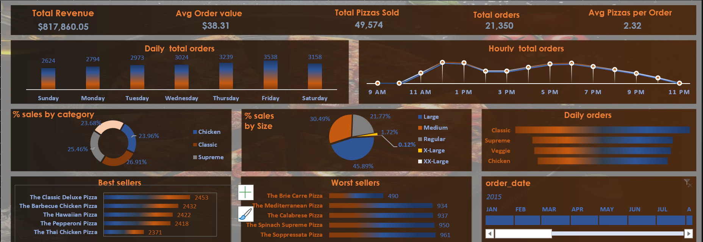

# 1. Introduction  
The Pizza Sales Dashboard is an interactive, Excel-based tool designed to offer a comprehensive view of pizza sales data. This dashboard empowers business owners and managers to visualize and analyze key performance indicators (KPIs) related to sales, revenue, and product performance.

### 
<em>The actions and steps involved are;.</em>

## Dataset

You can access the dataset here:  
[Download Pizza Sales Dataset](https://view.officeapps.live.com/op/view.aspx?src=https%3A%2F%2Fraw.githubusercontent.com%2Fbabazeek%2Fsales_dashboard%2Frefs%2Fheads%2Fmain%2Fpizza_sales%2520excel%2520file.xlsx&wdOrigin=BROWSELINK)

---

## SQL Queries

You can view the SQL queries used for the analysis here:  
[View Pizza Sales SQL Queries](https://raw.githubusercontent.com/babazeek/sales_dashboard/refs/heads/main/Pizza%20Sales%20Query.sql)

### a. Data Preparation  
The project began with collecting and cleaning raw data, including details such as order IDs, pizza types, sizes, quantities, and total price. This organized data served as the foundation for generating pivot tables and creating insightful visual charts.

### b. Pivot Table Setup  
To summarize the data, three pivot tables were created:
- **Total revenue by pizza category**
- **Sales by pizza size**
- **Daily order trends**

These pivot tables enabled us to group and analyze the data efficiently, providing a solid base for creating dynamic charts.

### c. Chart Design and Visualization  
Charts were created to bring the data to life, making complex numbers easier to interpret:
- **Donut Charts**: These were used to visualize sales distribution by category and size, providing quick insights into the most popular options.
- **Funnel Chart**: This chart illustrated the order trends over time, helping to identify peak sales periods.

### d. Best and Worst Sellers Analysis  
A key feature of the dashboard is its focus on identifying top and bottom-selling pizzas:
- **Top 5 Best Sellers**: We identified the pizzas with the highest sales and revenue.
- **Bottom 5 Worst Sellers**: Pizzas, which performed poorly in terms of orders, were highlighted.

This analysis allows the business to focus on promoting popular items while reevaluating or removing underperforming pizzas from the menu.

### e. Dashboard Integration  
The data and charts were brought together on a single dashboard for easy navigation:
- **PivotCharts**: Bar charts for best and worst sellers were integrated and formatted for clarity.
- **Slicer Tool**: A timeline slicer was added, allowing users to filter data by specific time periods, such as months or years.

### f. Interactivity and Customization  
To enhance user experience, the dashboard was made interactive. The slicer tool syncs all the charts, so selecting a different time period updates the data across the dashboard. This feature allows users to analyze trends and performance across various time frames.

### g. Project conclusion

The objective of this project was to create an insightful and interactive dashboard to analyze pizza sales data, providing key performance indicators (KPIs), sales trends, and a breakdown of performance according to category, size, and overall sales. The aim was to uncover actionable insights for decision-making, focusing on identifying best-selling items, underperforming products, and sales trends over time.

# 2.Key Findings from the Analysis:
From the dashboard, the following metrics can be determined and deployed to assist in decesion making:
- **Top Performers**: The Classic Deluxe and Chicken Pizza were found to be the top sellers, generating the highest revenue and order counts. These items represent the most significant drivers of business performance and should be prioritized in marketing and promotions.
  
- **Sales Trends**: The funnel chart revealed clear sales patterns over time, helping to identify peak sales periods. This trend analysis enables businesses to optimize staffing, inventory, and promotional efforts during high-demand periods.
  
- **Underperformers**: Certain pizzas, such as the Brick Hair Pizza and Sata Pizza, showed poor sales performance. With fewer orders, these items could potentially be reevaluated for removal from the menu or targeted for promotional activities to boost sales.
  
- **Size Proportions**: The analysis showed that large-sized pizzas are the most popular, accounting for the majority of orders. Smaller or less common sizes like extra-large and double extra-large underperformed, with double XL accounting for only 2% of total sales.

This dashboard was designed to address the need for a comprehensive, easy-to-navigate tool that displays real-time metrics and trends. It allows users to interact with the data by selecting different time periods and observing how the KPIs and sales trends evolve. The final outcome is an effective, data-driven decision-making tool that helps to streamline operations, prioritize best-sellers, and address underperforming products for potential improvement.
.

# 3. Conclusion  
The Pizza Sales Dashboard offers a powerful way to visualize and analyze pizza sales data. With its interactive features, it allows for quick decision-making and strategic planning. Managers can easily identify trends, track the performance of menu items, and make informed decisions based on real-time data.

# 4.The dashboard

## The whole project file
[Project file](https://view.officeapps.live.com/op/view.aspx?src=https%3A%2F%2Fraw.githubusercontent.com%2Fbabazeek%2Fsales_dashboard%2Frefs%2Fheads%2Fmain%2FPizza%2520Sales%2520dashboard.xlsx&wdOrigin=BROWSELINK)

.
